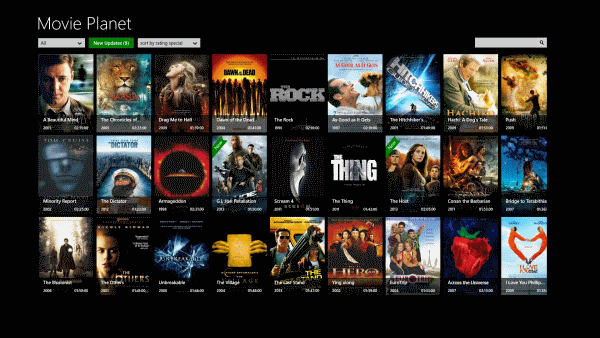

# Movie Planet

Приложение - энциклопедия фильмов.

Это приложение предназначенно для поиска фильмов по конкретным критериям.

Фильмы можно искать по:
 * _жанрам_ 
 * _странам_
 * _году выпуска_ 
 * _режиссеру_ 
 * _артистам_ 
  
При клике в странице поиска на фильме - показывается полная информация. 
Пользователи могут оценивать каждый фильм (ставить рейтинг) и добавлять рецензию. 

Базу фильмов можно взять с:
 * _imdb_
 * _кинопоиска_
 * _рутрекера (там есть готовая база торрентов по фильмам)_
 * _какого-нибудь готового веб-сервиса с этой информацией и использовать только API._